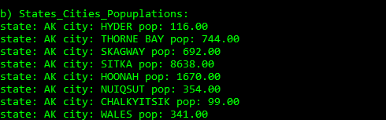

<!--
Copyright 2017 team1@course_bigdata, Saint Joseph's University

Licensed under the Apache License, Version 2.0 (the "License");
you may not use this file except in compliance with the License.
You may obtain a copy of the License at

   http://www.apache.org/licenses/LICENSE-2.0

Unless required by applicable law or agreed to in writing, software
distributed under the License is distributed on an "AS IS" BASIS,
WITHOUT WARRANTIES OR CONDITIONS OF ANY KIND, either express or implied.
See the License for the specific language governing permissions and
limitations under the License.
-->


<p>&nbsp;</p>
<p>&nbsp;</p>
<p>&nbsp;</p>
<p>&nbsp;</p>
<p>&nbsp;</p>
<p>&nbsp;</p>
<p>&nbsp;</p>
<p>&nbsp;</p>
<p>&nbsp;</p>
<p>&nbsp;</p>
<p>&nbsp;</p>
<p>&nbsp;</p>
<p>&nbsp;</p>
<p>&nbsp;</p>
<p>&nbsp;</p>
<p>&nbsp;</p>

# Project 1: MongoDB


*This project is developed by* ***Team 1***:
* Sarah Cooney
* Mingyuan Li
* Jason Qiao Meng

<div class="page-break"></div>

## Table of Content
<!-- TOC depthFrom:1 depthTo:6 withLinks:1 updateOnSave:1 orderedList:0 -->

- [Project 1: MongoDB](#project-1-mongodb)
	- [Table of Content](#table-of-content)
	- [Introduction](#introduction)
	- [Implementation](#implementation)
		- [Database Connection](#database-connection)
		- [Global Settings](#global-settings)
		- [NOSQL Queries](#nosql-queries)
			- [Query A](#query-a)
			- [Query B](#query-b)
			- [Query C](#query-c)
	- [Installation](#installation)
		- [Requirement](#requirement)
	- [Run the Queries](#run-the-queries)
		- [Set Up](#set-up)
		- [Begin Running the Queries](#begin-running-the-queries)
	- [References](#references)
	- [About Team 1](#about-team-1)

<!-- /TOC -->

<p>&nbsp;</p>
<p>&nbsp;</p>
<p>&nbsp;</p>

## Introduction
This project is a course project of **CSC643 - Bigdata**. It is about a MongoDB client script and a Python program which runs experimental `NOSQL` queries.

As required, This project implements the following queries on top of `zipcodes` database:
+ *Query A*: Find the total number of cities in the database.
+ *Query B*: Create the list of states, cities, and city populations.
+ *Query C*: List the cities in the state of Massachusetts with populations between 1000 and 2000.
+ *Query D*: A mapReducer to compute the total number of cities and total population in each state.
+ *Query E*: A mapReducer to find the average city population for each state.
+ *Query F*: A mapReducer to find the least densely-populated state(s).


## Implementation
The sources contains two parts, one is MongoDB client scripts, the other is the equivalents in Python.

The MongoDB client scripts is included by `src/queries.txt`; The Python equivalents are included by `src/queries.py`.

The Python implementation consists of a MongoDB connector module, a global environmental settings module, and the query runner module.

### Database Connection
MongoDB connection is managed by `mongodb_connector.py`. This module uses the `pymongo` library to create or destroy a connection to a MongoDB instance. The variables defined in `settings.py` are utilized in this module.

The file contains a class called `MongoDB` which acts as a MongoDB client which gets an instance of a database, gets an instance of a collection.

The member method `simple_connction_string` constructs a MongoDB connection string used by `pymongo` to connect to the MongoDB instance, and incorporates the protocol, host, and port variables defined in `settings.py`.

```python
def simple_connction_string(self):
    """Get the connection string.

    :return: A legal MongoDB connection string from the settings.
    """
    self.__conn_str = "%s%s:%s/" % (DB_PROTOCOL, DB_HOST, DB_PORT)
    return self.__conn_str
```
*Figure 1: `simple_connction_string` to constructs a MongoDB connection string.*

The next method in the class is `get_database`. This method is used to access a specific Mongo database. The method takes an optional `name` parameter.  If no database name is specified, the method defaults to the `DB_NAME` variable defined in `settings.py`.  An error is thrown if no database of the specified name exists, whether by parameter or from the `settings.py`.

```python
def get_database(self, name=None):
    """Get the database object with the specified name.

    :param name: The name of the database. If given None or omitted,
                 this method uses the name set in the settings file.
    :return: An instance of Database.
    """
    if not self.__client:
        self.get_client()

    dbname = name if name else DB_NAME
    try:
        self.__db = self.__client[dbname]
    except InvalidName as ine:
        self.__db = None
        print 'No such database: %s. %s' % (dbname, ine)

    return self.__db
```
*Figure 2: `get_database` to get a database instance.*

To use the class `MongoDB`, simply import the class from `mongodb_connector` module. Figure 3 demonstrates the usage.

```python
from mongodb_connector import MongoDB

if __name__ == '__main__':
    mongo = MongoDB()
    cli = mongo.get_client()
    if cli and cli.database_names():
        print 'connect successful'
        print 'databases: ',
        for n in cli.database_names():
            print '%s, ' % n,
        print ''
    db = mongo.get_database()
    if db:
        print 'database connected'
        print 'database test collections: ',
        for n in db.collection_names():
            print '%s, ' % n,
        print ''
        print 'database test get document count: ',
        collection = db[db.collection_names()[0]]
        print collection.count()
    mongo.close();
```
*Figure 3: Class `MongoDB` usage*

### Global Settings
To avoid modifications to the database connector class and concrete query functions, a `settings` module, implemented in `settings.py`, to manage the global shared environmental variables.

Both the module `mongodb_connector.py` and `queries.py` incorporate this settings module. Figure 4 shows the detail of `settings.py`.

```python
# database related
DB_NAME = "zipcodes"
DB_PROTOCOL = "mongodb://"
DB_HOST = "localhost"
DB_PORT = "27017"
COLLECTION = "zipcodes"
```
*Figure 4: The global variables*

### NOSQL Queries
This section will describe the setup of the queries.py file and give details about each of the six queries. Screenshots of the output for each query will also be shown.  

The `queries.py` file contains a function for each of the six queries and a main section that runs all six queries in succession.

The queries are:
+ *Query A*: Find the total number of cities in the database.
+ *Query B*: Create the list of states, cities, and city populations.
+ *Query C*: List the cities in the state of Massachusetts with populations between 1000 and 2000.
+ *Query D*: A mapReducer to compute the total number of cities and total population in each state.
+ *Query E*: A mapReducer to find the average city population for each state.
+ *Query F*: A mapReducer to find the least densely-populated state(s).

#### Query A
Query A: Find the total number of cities in the database.

This query, shown in Figure 5, is a simple `pymongo` query. The `distinct` command is used with the `city` parameter to find all of the distinct cities in the database, since some have multiple zipcodes; for instance, *Boston*. The Python `len` method was called on the collection that was returned to find the number. Figure 6 shows the output from this query.

```Python
def total_cities(mongodb):
    """This query function returns the total number of cities in the database."""
    db = mongodb.get_database()
    return len(db[COLLECTION].distinct('city'))
```
*Figure 5: Query A implementation*


*Figure 6: Query A output*

Shown by Figure 7, the actual MongoDB client command and output are:
```javascript
> use zipcodes;
> z = db.zipcodes;
> z.distinct("city").length;
    16584
```
*Figure 7: Query A by MongoDB client command*

#### Query B
Query B: Create the list of states, cities, and city populations.

This function uses MongoDB's aggregate framework; it constructs a pipeline for the aggregation. An array is created, and for each entry in the database, the state, city, and population information are appended and then added to the array. The method returns this array, which is printed in the output. Figure 8 shows the code for this query, and Figure 9 contains a sample of the output produced.

```python
def list_states_cities_populations(mongodb):
    """This query function returns the list of states, cities, populations in the database."""
    db = mongodb.get_database()
    collection = db[COLLECTION]
    pipline = [
        {"$project": {"state": 1, "city": 1,  "pop": 1}},
        {"$group": {
            "_id": SON([("state","$state"), ("city", "$city")]),
            "popTotal": {"$sum": "$pop"}
        }},
        {"$sort": {"_id.state": 1}}
    ]
    return collection.aggregate(pipline)
```
*Figure 8: Query B implementation*


*Figure 9: Query B output*

Shown by Figure 10, the actual MongoDB client command and sample output are:
```javascript
> db.zipcodes.aggregate([
... {$project: {state: 1, city: 1, pop: 1}},
... {$group: {
...     _id: {"state": "$state", "city": "$city"},
...     popTotal: {$sum: "$pop"}, }},
... {$sort: {state: 1}} ]);
{ "_id" : { "state" : "AK", "city" : "HYDER" }, "popTotal" : 116 }
{ "_id" : { "state" : "AK", "city" : "THORNE BAY" }, "popTotal" : 744 }
{ "_id" : { "state" : "AK", "city" : "SKAGWAY" }, "popTotal" : 692 }
{ "_id" : { "state" : "AK", "city" : "SITKA" }, "popTotal" : 8638 }
{ "_id" : { "state" : "AK", "city" : "HOONAH" }, "popTotal" : 1670 }
{ "_id" : { "state" : "AK", "city" : "NUIQSUT" }, "popTotal" : 354 }
{ "_id" : { "state" : "AK", "city" : "CHALKYITSIK" }, "popTotal" : 99 }
{ "_id" : { "state" : "AK", "city" : "WALES" }, "popTotal" : 341 }
{ "_id" : { "state" : "AK", "city" : "WAINWRIGHT" }, "popTotal" : 492 }
{ "_id" : { "state" : "AK", "city" : "VENETIE" }, "popTotal" : 184 }
{ "_id" : { "state" : "AK", "city" : "TELLER" }, "popTotal" : 260 }
{ "_id" : { "state" : "AK", "city" : "TANANA" }, "popTotal" : 345 }
{ "_id" : { "state" : "AK", "city" : "SELAWIK" }, "popTotal" : 0 }
{ "_id" : { "state" : "AK", "city" : "POINT HOPE" }, "popTotal" : 640 }
{ "_id" : { "state" : "AK", "city" : "GOLOVIN" }, "popTotal" : 3706 }
{ "_id" : { "state" : "AK", "city" : "NENANA" }, "popTotal" : 393 }
{ "_id" : { "state" : "AK", "city" : "POINT LAY" }, "popTotal" : 139 }
{ "_id" : { "state" : "AK", "city" : "MINTO" }, "popTotal" : 228 }
{ "_id" : { "state" : "AK", "city" : "LAKE MINCHUMINA" }, "popTotal" : 32 }
{ "_id" : { "state" : "AK", "city" : "MANLEY HOT SPRIN" }, "popTotal" : 122 }
Type "it" for more
```
*Figure 10: Query B by MongoDB client command*

#### Query C
Query C: List the cities in the state of Massachusetts with populations between 1000 and 2000.

Similar to the query B, This function uses MongoDB's aggregate framework; it constructs a pipeline for the aggregation. In addition, a `$match` filter is applied to filter and return just cities in the state of Massachusetts and then just those with populations between 1000 and 2000.

The results of the find are returned as an array. The code for query C is shown in Figure 11, and the output is shown in Figure 12.

```python
def list_massachusetts_populations(mongodb):
    """This query function returns the list the cities in the state of Massachusetts with populations between 1000 and 2000."""
    db = mongodb.get_database()
    collection = db[COLLECTION]
    pipline = [
        {"$match": {"state": "MA"}},
        {"$group": {
            "_id": SON([("state","$state"), ("city", "$city")]),
            "popTotal": {"$sum": "$pop"}
        }},
        {"$match": {"popTotal": {"$gte":1000, "$lte": 2000}}}
    ]

    return collection.aggregate(pipline)
```
*Figure 11: Query C implementation*


*Figure 12: Query C output*

Shown by Figure 13, the actual MongoDB client command and sample output are:
```javascript
> db.zipcodes.aggregate([
... {$match: {$and: [{state: "MA"}, {pop: {$gte: 1000, $lte: 2000}}]}},
... {$group: {
        _id: {"state": "$state", "city": "$city"},
...     popTotal: {$sum: "$pop"}}},
... ]);
{ "_id" : { "state" : "MA", "city" : "WEST TISBURY" }, "popTotal" : 1603 }
{ "_id" : { "state" : "MA", "city" : "HARWICH PORT" }, "popTotal" : 1843 }
{ "_id" : { "state" : "MA", "city" : "CAMBRIDGE" }, "popTotal" : 1336 }
{ "_id" : { "state" : "MA", "city" : "LYNN" }, "popTotal" : 1187 }
{ "_id" : { "state" : "MA", "city" : "ROCHDALE" }, "popTotal" : 1154 }
{ "_id" : { "state" : "MA", "city" : "WEST DENNIS" }, "popTotal" : 1347 }
{ "_id" : { "state" : "MA", "city" : "PETERSHAM" }, "popTotal" : 1131 }
{ "_id" : { "state" : "MA", "city" : "MONTAGUE" }, "popTotal" : 1699 }
{ "_id" : { "state" : "MA", "city" : "CONWAY" }, "popTotal" : 1524 }
{ "_id" : { "state" : "MA", "city" : "DIGHTON" }, "popTotal" : 1828 }
{ "_id" : { "state" : "MA", "city" : "HAWLEY" }, "popTotal" : 1325 }
{ "_id" : { "state" : "MA", "city" : "NEWTONVILLE" }, "popTotal" : 1427 }
{ "_id" : { "state" : "MA", "city" : "ASHFIELD" }, "popTotal" : 1535 }
{ "_id" : { "state" : "MA", "city" : "RICHMOND" }, "popTotal" : 1134 }
{ "_id" : { "state" : "MA", "city" : "WEST STOCKBRIDGE" }, "popTotal" : 1173 }
{ "_id" : { "state" : "MA", "city" : "WEST HARWICH" }, "popTotal" : 1061 }
{ "_id" : { "state" : "MA", "city" : "BECKET" }, "popTotal" : 1070 }
{ "_id" : { "state" : "MA", "city" : "DEERFIELD" }, "popTotal" : 1281 }
{ "_id" : { "state" : "MA", "city" : "OAKHAM" }, "popTotal" : 1503 }
{ "_id" : { "state" : "MA", "city" : "SHUTESBURY" }, "popTotal" : 1533 }
Type "it" for more
```
*Figure 10: Query B by MongoDB client command*

## Installation

### Requirement

## Run the Queries

### Set Up

### Begin Running the Queries

## References

## About Team 1
