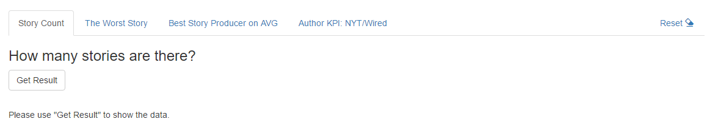
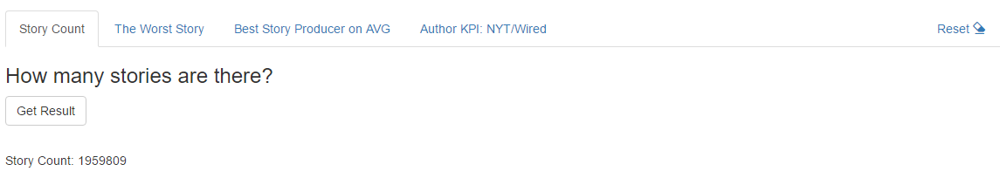
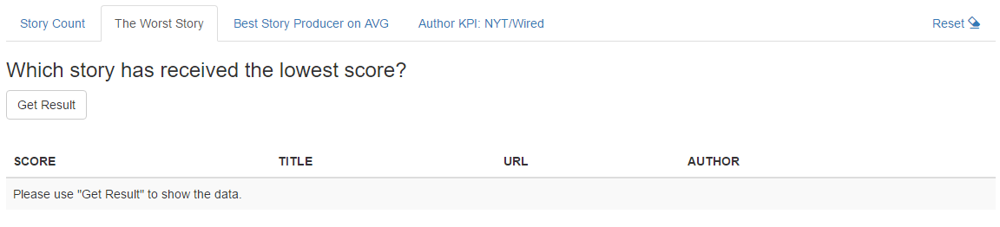
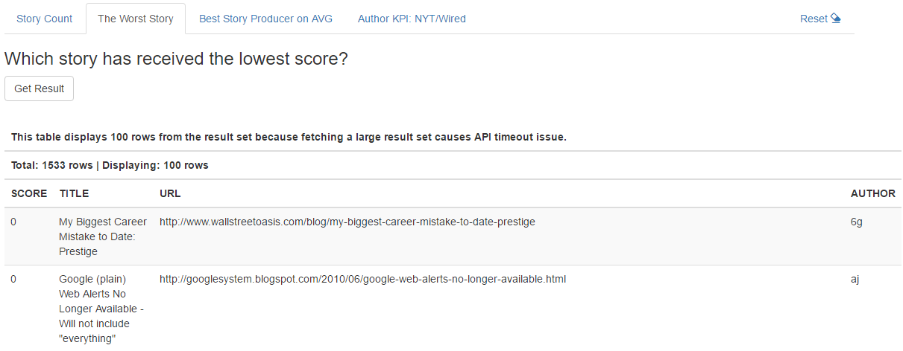
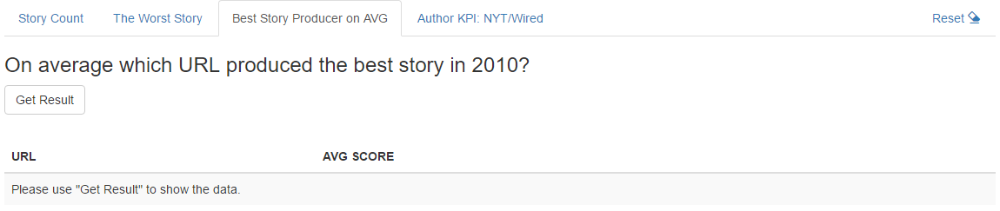
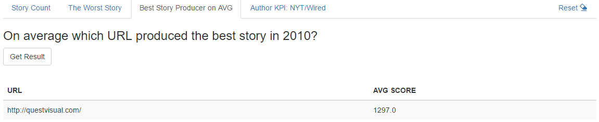
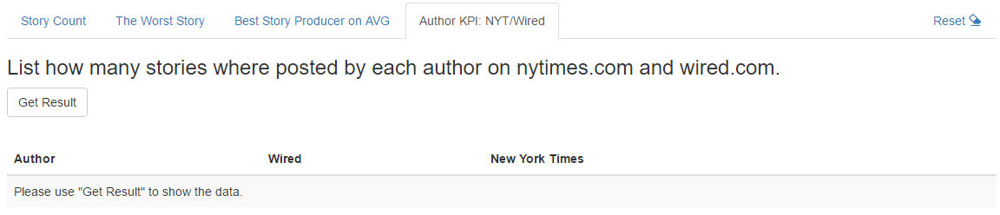
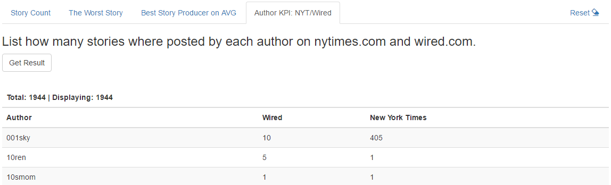

<!--
Copyright 2017 team1@course_bigdata, Saint Joseph's University

Licensed under the Apache License, Version 2.0 (the "License");
you may not use this file except in compliance with the License.
You may obtain a copy of the License at

   http://www.apache.org/licenses/LICENSE-2.0

Unless required by applicable law or agreed to in writing, software
distributed under the License is distributed on an "AS IS" BASIS,
WITHOUT WARRANTIES OR CONDITIONS OF ANY KIND, either express or implied.
See the License for the specific language governing permissions and
limitations under the License.
-->

<p>&nbsp;</p>
<p>&nbsp;</p>
<p>&nbsp;</p>
<p>&nbsp;</p>
<p>&nbsp;</p>
<p>&nbsp;</p>
<p>&nbsp;</p>
<p>&nbsp;</p>
<p>&nbsp;</p>
<p>&nbsp;</p>
<p>&nbsp;</p>
<p>&nbsp;</p>
<p>&nbsp;</p>
<p>&nbsp;</p>
<p>&nbsp;</p>
<p>&nbsp;</p>

# Project 2: Playing with Hacker News Data


*This project is developed by* ***Team 1***:
* Sarah Cooney
* Mingyuan Li
* Jason Qiao Meng

<div class="page-break"></div>

## Table of Content
- [Project 2: Playing with Hacker News Data](#project-2-playing-with-hacker-news-data)
    - [Table of Content](#table-of-content)
    - [Introduction](#introduction)
        - [License](#license)
    - [Implementation](#implementation)
        - [Technical Architecture](#technical-architecture)
            - [Overview](#overview)
            - [Sequence Diagram](#sequence-diagram)
        - [Settings](#settings)
        - [Connecting to Hacker News Public Data Set](#connecting-to-hacker-news-public-data-set)
        - [Functional Modules](#functional-modules)
            - [Query A: Story Count](#query-a-story-count)
            - [Query B: Stories Received the Lowest Score](#query-b-stories-received-the-lowest-score)
            - [Query C: URLs that Produced the Best Stories on Average](#query-c-urls-that-produced-the-best-stories-on-average)
            - [Query D: Story Count by Author on NYTimes.com and Wired.com](#query-d-story-count-by-author-on-nytimescom-and-wiredcom)
            - [Reset](#reset)
    - [Running the App](#running-the-app)
        - [Prerequisites](#prerequisites)
            - [Google Cloud SDK and App Engine](#google-cloud-sdk-and-app-engine)
            - [Python Libraries Required](#python-libraries-required)
            - [Google Cloud Project](#google-cloud-project)
        - [Configuration](#configuration)
        - [Launching The App](#launching-the-app)
- [About Team 1](#about-team-1)

## Introduction
This project is developed in Python. It is built on top of the [WebApp2][webapp2] framework with the standard [Python Client API Libraries][goog_py_cli_api] to access to Google's backend public datasets.

The application developed in this project allows web clients to process the following form-driven queries:
+ How many stories are there?
+ Which story has received the lowest score?
+ On average which URL produced the best story in 2010?
+ List how many stories were posted by each author on nytimes.com and wired.com.

*For team member contributions, see: [workload and responsibilities][ranking]*

### License
*Apache License V2.0* is applied to this project.

## Implementation
This project implements a lightweight web application which is designed for the [WebApp2][webapp2] framework and to be driven by the [Google App Engine][goog_python_app_engine].

The implementation incorporates the `Google Cloud BigQuery` library to execute some simple queries on Google's public data set `Hacker News`, and display the query results on an HTML template.

The source consists of 3 parts:
+ [x] A settings/configuration module to manage the global/customizable configurations
+ [x] A wrapper class `BigQuery` which provides major features to facilitate query execution. The class masks out the complexity of the library `google.cloud.bigquery`.
+ [x] A web application which conforms to the convention of [WebApp2][webapp2] and [Google App Engine][goog_python_app_engine], and which handles the requests from the web clients.

### Technical Architecture
Exclusively, the architecture of this App is designed on top of and for [WebApp2][webapp2] and [Google App Engine][goog_python_app_engine].

#### Overview


#### Sequence Diagram
The following diagram example demonstrates how the post request is handled by this App.


### Settings
To be able to connect to `Google BigQuery API`, the public data sets and developer's own data set, a set of environmental settings must be established, such as `project id`, `data set name`, `table name`, etc.

In the implementation, this project employs a settings module to manage the variables. One can make simple changes to the settings module to adapt for their local reality. See figures 1 and 2 for details.

```python
"""This file is the base configuration that keeps the CONSTANTS."""

# The source connection string for Hacker News
GOOG_HACKER_NEWS_TABLE_FULL = r'full'
GOOG_HACKER_NEWS_TABLE_STORIES = r'stories'
GOOG_HACKER_NEWS_SOURCE = r'hacker_news'
GOOG_PUBLIC_DATA_PROJ_ID = r'bigquery-public-data'
# The google service secret variable name
GOOG_CREDENTIALS_ENV_VAR = 'GOOGLE_APPLICATION_CREDENTIALS'

# The data table name
STORY_COUNT_TABLE_NAME = 'table_a'
LOWEST_SCORE_TABLE_NAME = 'table_b'
BEST_STORY_URL_AVG_TABLE_NAME = 'table_c'
STORY_COUNT_PER_AUTHOR = 'table_d'


import os
# To override base settings values
# if some are redefined in the cust_settings.py
from cust_settings import *
from google.appengine.api import urlfetch

# Create/set the environment variable for the google service credentials
if GOOG_CREDENTIALS_ENV_VAR not in os.environ:
    os.environ[GOOG_CREDENTIALS_ENV_VAR] = GOOG_CREDENTIALS_FILE_PATH

urlfetch.set_default_fetch_deadline(GOOG_API_FETCH_TIMEOUT)
```
*Figure 1: `settings.py` to manage the rarely changing variables*

```python
"""This file includes variables for the values that configurable and changing.
Developers shall keep their own versions locally for their own development environments.
The variables will be set to different values for the runtime environment.
"""

# The google project id - Place your project id here
GOOG_PROJECT_ID = r'<project_id>'
# The google service credentials.
GOOG_CREDENTIALS_FILE_PATH = r'<service_account_secret_json_file>'
# The dataset name
GOOG_DATASET_NAME = r'<dataset_id>'

# Query related
MAX_RESULT_COUNT = 500
# Google API timeout
GOOG_API_FETCH_TIMEOUT = 120
```
*Figure 2: `cust_settings.py` to manage the frequently changing variables*

### Connecting to Hacker News Public Data Set
The connection to the `hacker news` public data set is managed by the class `BigQuery` which is enclosed by the `Python` source file `bigquery.py`.

The method `get_client()`, as figure 3 shows, creates a `Google BigQuery API` client with the service credentials defined by the settings variables `GOOG_CREDENTIALS_ENV_VAR` and `GOOG_CREDENTIALS_FILE_PATH`. See the section [Settings](#settings) and [Configuration](#configuration) for more information.
```python
def get_client(self):
    """Get a client of the bigquery service.

    :return: An instance of the bigquery service client.
    :rtype: bigquery.Client
    """
    self.__cli = self.__cli if self.__cli else bigquery.Client(self.__proj)
    return self.__cli
```
*Figure 3: `get_client()` to create a `Google BigQuery Client` object.*

A query can be executed either synchronously or asynchronously. Figure 4 shows the method `sync_query` and figure 5 shows the method `async_query`.
```python
def sync_query(self, query, params=()):
    """Perform a query and return the result and the total count of the affected rows.
    To use the parameters, please refer to the example below::
        query_parameters=(
            bigquery.ScalarQueryParameter('corpus', 'STRING', corpus),
            bigquery.ScalarQueryParameter(
                'min_word_count',
                'INT64',
                min_word_count))

    :param query: A Standard SQL that Google BigQuery accepts.
    :type query: str
    :param params: (Optional) The parameters that the query uses.
    :type params: tuple
    :return: Returns the result set (only values) and the total count of the affected rows.
    :rtype: tuple
    """
    self.__cli = self.get_client()
    query_results = self.__cli.run_sync_query(query, query_parameters=params)

    # Use standard SQL syntax for queries.
    # See: https://cloud.google.com/bigquery/sql-reference/
    query_results.use_legacy_sql = False
    query_results.run()
    # get all possible rows
    pt = None
    rs = []
    while True:
        row_data, total_rows, pt = query_results.fetch_data(MAX_RESULT_COUNT, page_token=pt)
        rs += row_data
        if not pt:
            break

    return rs, total_rows
```
*Figure 4: `sync_query` to run a query synchronously*

```python
def async_query(self, query, params=(), dest_table=None, dest_dataset=None):
    """Perform a query *asynchronously* and return the result and the total count of the affected rows.

    :param query: A Standard SQL that Google BigQuery accepts.
    :type query: str
    :param params: (Optional) The parameters that the query uses.
    :type params: tuple
    :param dest_table: (Optional) The name of the destination table where the job saves the result set.
    :type dest_table: str
    :param dest_dataset: (Optional) The name of the dataset which has the destination table.
                        If omitted, ``GOOG_DATASET_NAME`` is used by default.
    :type dest_dataset: str
    :return: Returns the result set (only values) and the total count of the affected rows.
    :rtype: tuple
    """
    self.__cli = self.get_client()
    query_job = self.__cli.run_async_query(str(uuid.uuid4()), query, query_parameters=params)
    query_job.use_legacy_sql = False
    if dest_table:
        ds = self.__cli.dataset(dest_dataset) if dest_dataset else self.get_dataset()
        tbl_save = ds.table(dest_table)
        query_job.destination = tbl_save
        query_job.write_disposition = 'WRITE_TRUNCATE' if tbl_save.exists() else 'WRITE_EMPTY'

    query_job.begin()
    # wait for the job complete
    self.__async_wait(query_job)
    # Drain the query results by requesting a page at a time.
    query_results = query_job.results()
    rs = []
    pt = None
    while True:
        row_data, total_rows, pt = query_results.fetch_data(MAX_RESULT_COUNT, page_token=pt)
        rs += row_data
        if not pt:
            break

    return rs, total_rows
```
*Figure 5: `async_query` to run a query asynchronously*

The `BigQuery` class also provides a function `build_params()` to construct simple parameters for a parameterized query. Figure 6 shows how the parameters are built.
```python
@classmethod
def build_params(cls, params):
    """Construct a tuple of the SQL parameters.

    `Note: this function produce scalar parameters only.`

    :param params: A ``python`` ``dict`` which holds the parameters
                   in form of {'name': value} where the value can be any object.
    :type params: dict
    :return: Returns a tuple of SQL parameter objects
    :rtype: tuple
    """
    if not params:
        return None

    def get_type(k, v):
        t = 'STRING'
        if isinstance(v, int):
            t = 'INT64'
        elif isinstance(v, float):
            t = 'FLOAT64'
        elif isinstance(v, bool):
            t = 'BOOL'
        return bigquery.ScalarQueryParameter(k, t, v)

    return tuple([get_type(key, value) for key, value in params.iteritems()])
```
*Figure 6: `build_params()` to construct parameters*

### Functional Modules
While the `BigQuery` class acts as the fundamental module, the queries and client requests are handled by the functional modules. The module `hacker_news.py` includes functions to run the queries that are asked by the requirements; The view controller modules incorporates the [WebApp2][webapp2] framework to handle the requests and responses.

#### Query A: Story Count
This query's request is sent by an HTML form and is handled by the view class `TotalStoryCount`. The query is executed by the function `get_story_count()` in `hacker_news.py`.

Figures 7 and 8 show the implementations.

```python
class TotalStoryCount(webapp2.RequestHandler):
    def post(self):
        rows = hacker.get_story_count()
        temp_vals = {
            'active_tab': 'QueryA',
            'values': rows if rows else None
        }
        path = os.path.join(os.path.dirname(__file__), 'index.html')
        self.response.headers['Content-Type'] = 'text/html'
        self.response.out.write(template.render(path, temp_vals))

```
*Figure 7: class `TotalStoryCount` to handle the form POST request*


```python
def get_story_count():
    sql = """
        SELECT COUNT(id) AS storyCount
        FROM `$proj.$ds.$table`
    """
    sub = {
        'proj': GOOG_PUBLIC_DATA_PROJ_ID,
        'ds': GOOG_HACKER_NEWS_SOURCE,
        'table': GOOG_HACKER_NEWS_TABLE_STORIES
    }

    bq = BigQuery()
    bq.get_client()
    return bq.async_query(Template(sql).substitute(sub), params=(), dest_table=STORY_COUNT_TABLE_NAME)[0]

```
*Figure 8: `get_story_count()` to run the query*

Figures 9 and 10 depict the UI at the client side before and after the query request.


*Figure 9: UI before user clicks on `Get Result`*


*Figure 10: UI after user clicks on `Get Result`*

#### Query B: Stories Receiving the Lowest Score
This query's request is sent by an HTML form and is handled by the view class `LowestStoryScore`; the query is executed by the function `get_lowest_story_score()` in `hacker_news.py`.

Due to API result fetching timeout issue, the function `get_lowest_story_score()` gets only `MAX_RESULT_COUNT` number of result records. For instance, `100` is set and shown by figure 14.

Figures 11 and 12 show the implementations.

```python
class LowestStoryScore(webapp2.RequestHandler):
    def post(self):
        rows, count = hacker.get_lowest_story_score()
        temp_vals = {
            'active_tab': 'QueryB',
            'total_count': count,
            'values': rows if rows else None
        }
        path = os.path.join(os.path.dirname(__file__), 'index.html')
        self.response.headers['Content-Type'] = 'text/html'
        self.response.out.write(template.render(path, temp_vals))
```
*Figure 11: class `LowestStoryScore` to handle the form POST request*


```python
def get_lowest_story_score():
    sql = """
        SELECT score, title, url, author
        FROM `$proj.$ds.$table`
        WHERE score is not null
        AND score <= (SELECT MIN(score) FROM `$proj.$ds.$table`)
    """
    sub = {
        'proj': GOOG_PUBLIC_DATA_PROJ_ID,
        'ds': GOOG_HACKER_NEWS_SOURCE,
        'table': GOOG_HACKER_NEWS_TABLE_STORIES
    }

    bq = BigQuery()
    bq.get_client()
    return bq.async_query(Template(sql).substitute(sub), dest_table=LOWEST_SCORE_TABLE_NAME)
```
*Figure 12: `get_lowest_story_score()` to run the query*

Figures 13 and 14 depict the UI at the client side before and after the query request.


*Figure 13: UI before user clicks on `Get Result`*


*Figure 14: UI after user clicks on `Get Result`*

#### Query C: URLs that Produced the Best Stories on Average
This query's request is sent by an HTML form and is handled by the view class `BestStoryProducerAVG`.  The query is executed by the function `best_story_producer_on_avg()` in `hacker_news.py`.

Figures 15 and 16 show the implementations.

```python
class BestStoryProducerAVG(webapp2.RequestHandler):
    def post(self):
        rows = hacker.best_story_producer_on_avg()
        temp_vals = {
            'active_tab': 'QueryC',
            'values': rows if rows else None
        }
        path = os.path.join(os.path.dirname(__file__), 'index.html')
        self.response.headers['Content-Type'] = 'text/html'
        self.response.out.write(template.render(path, temp_vals))
```
*Figure 15: class `BestStoryProducerAVG` to handle the form POST request*


```python
def best_story_producer_on_avg():
    sql = """
        SELECT url, AVG(score) AS avgScore
        FROM `$proj.$ds.$table`
        WHERE
            TYPE = @type
        AND TIMESTAMP <= @end_date
        AND TIMESTAMP >= @start_date
        GROUP BY url
        HAVING avgScore >= (
          SELECT AVG(score) AS score
          FROM `$proj.$ds.$table`
          WHERE
              TYPE = @type
          AND url IS NOT NULL
          AND url <> ''
          AND TIMESTAMP <= @end_date
          AND TIMESTAMP >= @start_date
          GROUP BY url
          ORDER BY score DESC
          LIMIT 1 )
          ORDER BY avgScore DESC
    """
    sub = {
        'proj': GOOG_PUBLIC_DATA_PROJ_ID,
        'ds': GOOG_HACKER_NEWS_SOURCE,
        'table': GOOG_HACKER_NEWS_TABLE_FULL
    }
    params = {
        'type': 'story',
        'start_date': '2010-01-01 00:00:01',
        'end_date': '2010-12-31 23:59:59'
    }
    p = BigQuery.build_params(params)

    bq = BigQuery()
    bq.get_client()
    return bq.async_query(Template(sql).substitute(sub), p, BEST_STORY_URL_AVG_TABLE_NAME)[0]
```
*Figure 16: `best_story_producer_on_avg()` to run the query*

Figures 17 and 18 depict the UI at the client side before and after the query request.


*Figure 17: UI before user clicks on `Get Result`*


*Figure 18: UI after user clicks on `Get Result`*

#### Query D: Story Count by Author on NYTimes.com and Wired.com
This query's request is sent by a HTML form and is handled by the view class `StoryCountByAuthorOnDomain`. The query is executed by the function `get_wired_and_nyt_counts()` in `hacker_news.py`.

Figures 19 and 20 show the implementations.

```python
class StoryCountByAuthorOnDomain(webapp2.RequestHandler):
    def post(self):
        rows, count = hacker.get_wired_and_nyt_counts()
        temp_vals = {
            'active_tab': 'QueryD',
            'total_count': count,
            'values': rows if rows else None
        }
        path = os.path.join(os.path.dirname(__file__), 'index.html')
        self.response.headers['Content-Type'] = 'text/html'
        self.response.out.write(template.render(path, temp_vals))
```
*Figure 19: class `StoryCountByAuthorOnDomain` to handle the form POST request*


```python
def get_wired_and_nyt_counts():
    nested = """
    SELECT author, COUNT(id) AS $column
    FROM `$proj.$ds.$table`
    WHERE
        author IS NOT NULL
    AND url IS NOT NULL
    AND REGEXP_CONTAINS(url, r'$regexp')
    GROUP BY author
    """

    sql = """
    SELECT
      wired.author AS author,
      wired.$wired_col AS on_wired_com,
      nytimes.$nyt_col AS on_nytimes_com
    FROM ($wired) wired
    JOIN ($nyt) nytimes ON wired.author = nytimes.author
    ORDER BY author
    """
    sub_wired = {
        'proj': GOOG_PUBLIC_DATA_PROJ_ID,
        'ds': GOOG_HACKER_NEWS_SOURCE,
        'table': GOOG_HACKER_NEWS_TABLE_STORIES,
        'column': 'on_wired_com',
        'regexp': r'wired\.com'
    }

    sub_nyt = {
        'proj': GOOG_PUBLIC_DATA_PROJ_ID,
        'ds': GOOG_HACKER_NEWS_SOURCE,
        'table': GOOG_HACKER_NEWS_TABLE_STORIES,
        'column': 'on_nytimes_com',
        'regexp': r'nytimes\.com'
    }

    sub = {
        'wired': Template(nested).substitute(sub_wired),
        'nyt': Template(nested).substitute(sub_nyt),
        'nyt_col': 'on_nytimes_com',
        'wired_col': 'on_wired_com',
    }

    bq = BigQuery()
    bq.get_client()
    return bq.async_query(Template(sql).substitute(sub), params=(), dest_table=STORY_COUNT_PER_AUTHOR)
```
*Figure 20: `get_wired_and_nyt_counts()` to run the query*

Figures 21 and 22 depict the UI at the client side before and after the query request.


*Figure 21: UI before user clicks on `Get Result`*


*Figure 22: UI after user clicks on `Get Result`*

#### Reset
The feature `Reset` offers a complete cleanup. It removes the data set which is defined by `GOOG_DATASET_NAME` and recreates the data set under the project.

Figures 23 and 24 show the implementations.

```python
class Reset(webapp2.RequestHandler):
    """Performs a environment clean-up."""

    def get(self):
        hacker.reset()
        self.redirect('/')
```
*Figure 23: class `Reset` to handle the client request*

```python
def reset():
    bq = BigQuery()
    bq.get_client()
    ds = bq.get_dataset()
    if ds.exists():
        for t in ds.list_tables():
            t.delete()
        ds.reload()
        ds.delete()
    ds.create()
```
*Figure 24: `reset()` to remove and recreate the data set*

## Running the App
This web app is developed for the [Google App Engine][goog_python_app_engine]. It can run locally without `Google Cloud Platform`'s `standard environment`.
However, there are a few things to be done before the app can be run.

### Prerequisites
Make sure the following software packages are installed.

#### Google Cloud SDK and App Engine
+ Download and install the `Google Cloud SDK` from https://cloud.google.com/sdk/docs/.
+ Initialize the `Google Cloud Client` environment by using the following command:
```cmd
X:\> gcloud init
```
+ Install [Google App Engine][goog_python_app_engine] by using the following commands:
```cmd
X:\> gcloud components install app-engine-python
X:\> gcloud components install app-engine-python-extras
```

#### Python Libraries Required
Go to the project's `src` directory, make a sub directory named `lib`, and apply the following commands:
```cmd
X:\> pip install -U -t lib/ google-api-python-client
X:\> pip install -U -t lib/ google-cloud-bigquery
```

#### Google Cloud Project
A valid `Google Cloud` project is used by this app.

+ Go to [Google Cloud Console](https://console.cloud.google.com) and make sure there is a functional project.
+ Go to `IAM & Admin` page of the `Google Cloud Console`, assign `Bigquery > Data Owner` role to the service account.

### Configuration
Before the app can be driven by the [Google App Engine][goog_python_app_engine], a few changes should be made for the project to adapt to the local environment.

Open `cust_settings.py`, set the proper values to the following variables:
```python
# The google project id - Place your project id here
GOOG_PROJECT_ID = r'<project_id>'
# The google service credentials.
GOOG_CREDENTIALS_FILE_PATH = r'<service_account_secret_json_file>'
# The dataset name
GOOG_DATASET_NAME = r'<dataset_id>'
```

### Launching The App
Use the following command to run the web app:
```cmd
X:\<project_root>\src\> dev_appserver.py app.yaml
```

# About Team 1
Team 1 consists of three members, who are:
+ Jason Qiao Meng *(Team Lead)*
+ Sarah Cooney *(Developer)*
+ Mingyuan Li *(Developer)*

<!-- Reference links -->
[goog_bigquery]: https://cloud.google.com/bigquery/docs/  "Google BigQuery Documentation"
[bigtable_hacker_news]: https://cloud.google.com/bigquery/public-data/hacker-news "Hacker News Data"
[goog_python_app_engine]: https://cloud.google.com/appengine/docs/standard/python/ "Google App Engine Python Standard Environment Documentation"
[webapp2]: https://cloud.google.com/appengine/docs/standard/python/tools/webapp2 "The webapp2 Framework"
[goog_py_cli_api]: https://developers.google.com/api-client-library/python/ "Google Python Client API"
[ranking]: ranking.html "Team Member Efforts & Contributions"
