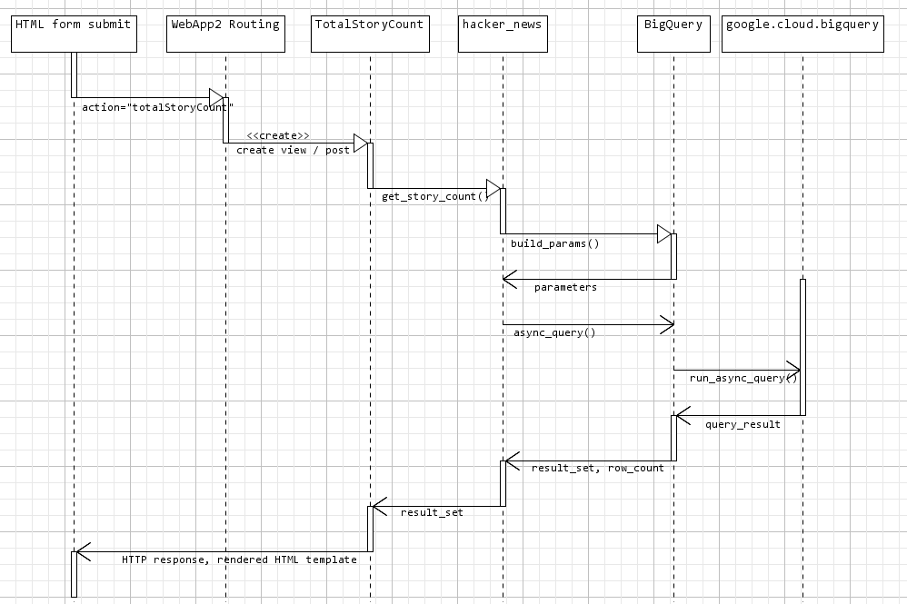

<!--
Copyright 2017 team1@course_bigdata, Saint Joseph's University

Licensed under the Apache License, Version 2.0 (the "License");
you may not use this file except in compliance with the License.
You may obtain a copy of the License at

   http://www.apache.org/licenses/LICENSE-2.0

Unless required by applicable law or agreed to in writing, software
distributed under the License is distributed on an "AS IS" BASIS,
WITHOUT WARRANTIES OR CONDITIONS OF ANY KIND, either express or implied.
See the License for the specific language governing permissions and
limitations under the License.
-->

<p>&nbsp;</p>
<p>&nbsp;</p>
<p>&nbsp;</p>
<p>&nbsp;</p>
<p>&nbsp;</p>
<p>&nbsp;</p>
<p>&nbsp;</p>
<p>&nbsp;</p>
<p>&nbsp;</p>
<p>&nbsp;</p>
<p>&nbsp;</p>
<p>&nbsp;</p>
<p>&nbsp;</p>
<p>&nbsp;</p>
<p>&nbsp;</p>
<p>&nbsp;</p>

# Project 2: Playing with Hacker News Data


*This project is developed by* ***Team 1***:
* Sarah Cooney
* Mingyuan Li
* Jason Qiao Meng

<div class="page-break"></div>

## Table of Content
- [Project 2: Playing with Hacker News Data](#project-2-playing-with-hacker-news-data)
    - [Table of Content](#table-of-content)
    - [Introduction](#introduction)
        - [License](#license)
    - [Implementation](#implementation)
        - [Technical Architecture](#technical-architecture)
            - [Overview](#overview)
            - [Sequence Diagram](#sequence-diagram)
        - [Connecting to Hacker News Public Data Set](#connecting-to-hacker-news-public-data-set)
        - [Global Settings](#global-settings)
        - [Features](#features)
    - [Running the App](#running-the-app)
        - [Prerequisites](#prerequisites)
            - [Google Cloud SDK and App Engine](#google-cloud-sdk-and-app-engine)
            - [Python Libraries Required](#python-libraries-required)
            - [Google Cloud Project](#google-cloud-project)
        - [Configuration](#configuration)
        - [Launching The App](#launching-the-app)
- [About Team 1](#about-team-1)

<p>&nbsp;</p>
<p>&nbsp;</p>
<p>&nbsp;</p>
<p>&nbsp;</p>

## Introduction
This project is developed in Python. It is built on top of [WebApp2][webapp2] framework with the standard [Python Client API Libraries][goog_py_cli_api] to access to Google's backend public datasets.

The application developed in this project allows web clients to process the following form-driven queries:
+ How many stories are there?
+ Which story has received the lowest score?
+ On average which URL produced the best story in 2010?
+ List how many stories where posted by each author on nytimes.com and wired.com.

*For team member contributions, see: [workload and responsibilities][ranking]*

### License
*Apache License V2.0* is applied to this project.

## Implementation
This project implements a lightweight web application which is designed for [WebApp2][webapp2] framework and to be driven by [Google App Engine][goog_python_app_engine].

The implementation incorporates `Google Cloud BigQuery` library to execute some simple queries towards Google's public data set `Hacker News`, and display the query results on a HTML template.

The source consists of 2 parts:
+ A wrapper class `BigQuery` which provides major features to facilitate query execution. Such class masks out the complexity of library `google.cloud.bigquery`.
+ A web application which conforms to the convention of [WebApp2][webapp2] and [Google App Engine][goog_python_app_engine], and which handles the requests from the web clients.

### Technical Architecture
Exclusively, the architecture of this App is designed on top of and for [WebApp2][webapp2] and [Google App Engine][goog_python_app_engine].

#### Overview


#### Sequence Diagram
The following diagram example demonstrates how the post request is handled by this App.


### Connecting to Hacker News Public Data Set
The connection to the `hacker news` public data set is managed by the class `BigQuery` which is enclosed by the `Python` source file `bigquery.py`.

The method `get_client()`, as figure 1 shows, creates a `Google BigQuery API` client with the service credentials defined by the settings variables `GOOG_CREDENTIALS_ENV_VAR` and `GOOG_CREDENTIALS_FILE_PATH`. See the section [Configuration](#configuration) for more information.
```python
def get_client(self):
    """Get a client of the bigquery service.

    :return: An instance of the bigquery service client.
    :rtype: bigquery.Client
    """
    self.__cli = self.__cli if self.__cli else bigquery.Client(self.__proj)
    return self.__cli
```
*Figure 1: `get_client()` to create a `Google BigQuery Client` object.*

A query can be executed in either synchronous or asynchronous way. Figure 2 shows the method `sync_query` and figure 3 shows the method `async_query`.
```python
def sync_query(self, query, params=()):
    """Perform a query and return the result and the total count of the affected rows.
    To use the parameters, please refer to the example below::
        query_parameters=(
            bigquery.ScalarQueryParameter('corpus', 'STRING', corpus),
            bigquery.ScalarQueryParameter(
                'min_word_count',
                'INT64',
                min_word_count))

    :param query: A Standard SQL that Google BigQuery accepts.
    :type query: str
    :param params: (Optional) The parameters that the query uses.
    :type params: tuple
    :return: Returns the result set (only values) and the total count of the affected rows.
    :rtype: tuple
    """
    self.__cli = self.get_client()
    query_results = self.__cli.run_sync_query(query, query_parameters=params)

    # Use standard SQL syntax for queries.
    # See: https://cloud.google.com/bigquery/sql-reference/
    query_results.use_legacy_sql = False
    query_results.run()
    # get all possible rows
    pt = None
    rs = []
    while True:
        row_data, total_rows, pt = query_results.fetch_data(MAX_RESULT_COUNT, page_token=pt)
        rs += row_data
        if not pt:
            break

    return rs, total_rows
```
*Figure 2: `sync_query` to run a query synchronously*

```python
def async_query(self, query, params=(), dest_table=None, dest_dataset=None):
    """Perform a query *asynchronously* and return the result and the total count of the affected rows.

    :param query: A Standard SQL that Google BigQuery accepts.
    :type query: str
    :param params: (Optional) The parameters that the query uses.
    :type params: tuple
    :param dest_table: (Optional) The name of the destination table where the job saves the result set.
    :type dest_table: str
    :param dest_dataset: (Optional) The name of the dataset which has the destination table.
                        If omitted, ``GOOG_DATASET_NAME`` is used by default.
    :type dest_dataset: str
    :return: Returns the result set (only values) and the total count of the affected rows.
    :rtype: tuple
    """
    self.__cli = self.get_client()
    query_job = self.__cli.run_async_query(str(uuid.uuid4()), query, query_parameters=params)
    query_job.use_legacy_sql = False
    if dest_table:
        ds = self.__cli.dataset(dest_dataset) if dest_dataset else self.get_dataset()
        tbl_save = ds.table(dest_table)
        query_job.destination = tbl_save
        query_job.write_disposition = 'WRITE_TRUNCATE' if tbl_save.exists() else 'WRITE_EMPTY'

    query_job.begin()
    # wait for the job complete
    self.__async_wait(query_job)

    # Drain the query results by requesting a page at a time.
    query_results = query_job.results()
    rs = []
    pt = None
    while True:
        row_data, total_rows, page_token = query_results.fetch_data(MAX_RESULT_COUNT, page_token=pt)
        # rs += [row for row in row_data]
        rs += row_data
        if not page_token:
            break

    return rs, total_rows
```
*Figure 3: `async_query` to run a query asynchronously*

The `BigQuery` class also provides a function `build_params()` to construct simple parameters for a parameterized query. Figure 4 shows how the paramters are built.
```python
@classmethod
def build_params(cls, params):
    """Construct a tuple of the SQL parameters.

    `Note: this function produce scalar parameters only.`

    :param params: A ``python`` ``dict`` which holds the parameters
                   in form of {'name': value} where the value can be any object.
    :type params: dict
    :return: Returns a tuple of SQL parameter objects
    :rtype: tuple
    """
    if not params:
        return None

    def get_type(k, v):
        t = 'STRING'
        if isinstance(v, int):
            t = 'INT64'
        elif isinstance(v, float):
            t = 'FLOAT64'
        elif isinstance(v, bool):
            t = 'BOOL'
        return bigquery.ScalarQueryParameter(k, t, v)

    return tuple([get_type(key, value) for key, value in params.iteritems()])
```
*Figure 4: `build_params()` to construct parameters*

### Functional Modules
While the `BigQuery` class acts as the fundamental module, The queries and client requests are handled by the functional modules. The module `hacker_news.py` includes functions to run the queries that are asked by the requirements; The view controller modules incorporates [WebApp2][webapp2] framework to handle the requests and responses.

The query requests are:
+ How many stories are there?
+ Which story has received the lowest score?
+ On average which URL produced the best story in 2010?
+ List how many stories where posted by each author on nytimes.com and wired.com.

#### Story

## Running the App
This web app is development for [Google App Engine][goog_python_app_engine]. It can run locally without `Google Cloud Platform`'s `standard environment`.
However there are a few things to be done before the app can be run.

### Prerequisites
Make sure the following software packages are installed.

#### Google Cloud SDK and App Engine
+ Download and install the `Google Cloud SDK` from https://cloud.google.com/sdk/docs/.
+ Initialize the `Google Cloud Client` environment by using the following command:
```cmd
X:\> gcloud init
```
+ Install [Google App Engine][goog_python_app_engine] by using the following commands:
```cmd
X:\> gcloud components install app-engine-python
X:\> gcloud components install app-engine-python-extras
```

#### Python Libraries Required
Go to the project's `src` directory, make a sub directory named `lib`, and apply the following commands:
```cmd
X:\> pip install -U -t lib/ google-api-python-client
X:\> pip install -U -t lib/ google-cloud-bigquery
```

#### Google Cloud Project
A valid `Google Cloud` project is used by this app.

+ Go to [Google Cloud Console](https://console.cloud.google.com) and make sure there is a functional project.
+ Go to `IAM & Admin` page of the `Google Cloud Console`, assign `Bigquery > Data Owner` role to the service account.

### Configuration
Before the app can be driven by the [Google App Engine][goog_python_app_engine], A few changes should be made for the project to adapt to the local environment.

Open `cust_settings.py`, set the proper values to the following variables:
```python
# The google project id - Place your project id here
GOOG_PROJECT_ID = r'<project_id>'
# The google service credentials.
GOOG_CREDENTIALS_FILE_PATH = r'<service_account_secret_json_file>'
# The dataset name
GOOG_DATASET_NAME = r'<dataset_id>'
```

### Launching The App
Use the following command to run the web app:
```cmd
X:\<project_root>\src\> dev_appserver.py app.yaml
```

# About Team 1
Team 1 consists of three members, who are:
+ Jason Qiao Meng *(Team Lead)*
+ Sarah Cooney *(Developer)*
+ Mingyuan Li *(Developer)*

<!-- Reference links -->
[goog_bigquery]: https://cloud.google.com/bigquery/docs/  "Google BigQuery Documentation"
[bigtable_hacker_news]: https://cloud.google.com/bigquery/public-data/hacker-news "Hacker News Data"
[goog_python_app_engine]: https://cloud.google.com/appengine/docs/standard/python/ "Google App Engine Python Standard Environment Documentation"
[webapp2]: https://cloud.google.com/appengine/docs/standard/python/tools/webapp2 "The webapp2 Framework"
[goog_py_cli_api]: https://developers.google.com/api-client-library/python/ "Google Python Client API"
[ranking]: ranking.html "Team Member Efforts & Contributions"
