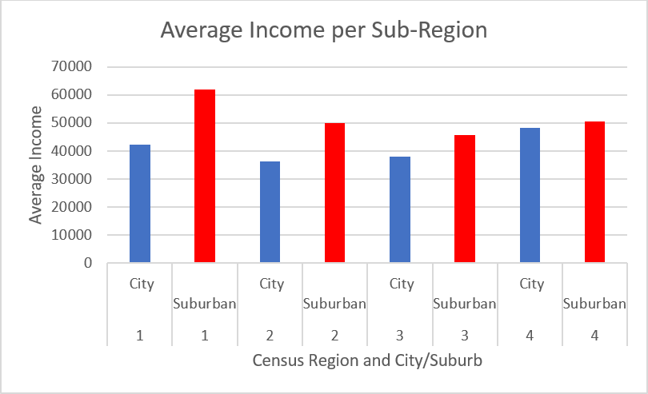

<!--
Copyright 2017 team1@course_bigdata, Saint Joseph's University

Licensed under the Apache License, Version 2.0 (the "License");
you may not use this file except in compliance with the License.
You may obtain a copy of the License at

   http://www.apache.org/licenses/LICENSE-2.0

Unless required by applicable law or agreed to in writing, software
distributed under the License is distributed on an "AS IS" BASIS,
WITHOUT WARRANTIES OR CONDITIONS OF ANY KIND, either express or implied.
See the License for the specific language governing permissions and
limitations under the License.
-->

<p>&nbsp;</p>
<p>&nbsp;</p>
<p>&nbsp;</p>
<p>&nbsp;</p>
<p>&nbsp;</p>
<p>&nbsp;</p>
<p>&nbsp;</p>
<p>&nbsp;</p>
<p>&nbsp;</p>
<p>&nbsp;</p>
<p>&nbsp;</p>
<p>&nbsp;</p>


# Project 3: A Simple Analysis of Housing Affordability Data by Using Hadoop

*This project is developed by* ***Team 1***:
* Sarah Cooney
* Mingyuan Li
* Jason Qiao Meng

<div class="page-break"></div>

## Table of Content
- [Project 3: A Simple Analysis of Housing Affordability Data by Using Hadoop](#project-3-a-simple-analysis-of-housing-affordability-data-by-using-hadoop)
	- [Table of Content](#table-of-content)
	- [Introduction](#introduction)
		- [2013 HADS Data Analysis](#2013-hads-data-analysis)
		- [2003-2013 HADS Data Analysis](#2003-2013-hads-data-analysis)
		- [License](#license)
	- [Implementation](#implementation)
		- [Overview](#overview)
		- [The Data Preprocessor Tool](#the-data-preprocessor-tool)
		- [The Mappers](#the-mappers)
			- [The Base Mapper](#the-base-mapper)
			- [The Concrete Mappers](#the-concrete-mappers)
		- [The Reducer](#the-reducer)
		- [The Main Runner](#the-main-runner)
	- [Compiling the Project](#compiling-the-project)
	- [Running the Map/Reduce Process](#running-the-mapreduce-process)
- [About Team 1](#about-team-1)

## Introduction
*For team member contributions, see: [workload and responsibilities][ranking]*

This project work with the [Housing Affordability Data System][hads], which is a set of files derived from the 1985 and later national American Housing Survey (AHS) and the 2002 and later Metro AHS. The data is provided by [the U.S goverment's open data][gov_data].

This project is developed in `Java` with `JDK7` and is designed for [Apache Hadoop 2.7.x][apache_hadoop], to analyze [the 2013 HADS data][hads_2013] and compute the correlation between:
+ Occupant data
    + Age of the head of the house hold
    + Number of persons in the household
    + Owner/renter status
+ Location
    + City and Suburban
    + Region
+ Income
    + Household income

There can be many perspectives/angles to use/cook and to analyze the data. We broke down the housing data for analysis based on location criteria. The first level by which the data was broken down was census region.

There are four census regions in the USA. The map *(figure 1)* below shows the regions which are numbered as follows:
`1 = Northeast, 2 = Midwest, 3 = South, and 4 = West`


*Figure 1: The U.S. Regions*

The regions were further broken down into two categories: Central City and Suburban. These categories are not necessarily the best breakdown that could have been achieved, as to call everything outside of a city suburban is a gross overstatement. However, this is what was provided in the HADS dataset. (The Census Bureau officially breaks down each of the four regions as shown in the map, however these breakdowns were not included in the dataset we analyzed.)

To analyze each of the eight sub-regions (census region and city or suburb), we did the following:
1. We loaded the data into Excel and checked each of the columns we planned to use and identified what value was used as `null` by the creators of the datasets.
1. In our Map function, we checked for these values. Rows with `null` values were given a count of 0. Furthermore, households with `null` incomes were given an income of 0.
1. If none of the values under consideration were `null`, we calculated a metric we called rating. Rows with `null` values were also given a rating of 0.
1. The rating was calculated as follows:
    1. the age of the head of household mod `10` was added to the number of persons in the household.
    1. Then `1` was added if the household had the "owned" while `2` was added for a status of "rented".  
1. A key of the form "`Region number, City or Suburb`" was emitted with a value of the form "`count, rating, income`".
1. In the reduce function, we created variables for `total count`, `income count`, `rating sum` and `income sum`.  
1. We obtained a count of the total households rated by summing the counts of the households. Since households with `null` values (which were not rated) were given a count of 0, they could be added to the total count without affecting the value, alleviating the need for if statements. The ratings could be summed in the same way since households with null values were also given a rating of zero.  
1. The income value given in the dataset was described as a sum of wage and salary income. Some households reported a value of `0`, which was separate from the `null` value for this column. (A possible explanation for this is that `null` values were used for vacant homes while `0` was used for income that was unreported. Another possibility is that houses with `0` income from wage or salary had an alternative income source such as social security, investments, etcetera, not distributed in a traditional manner.) When summing the incomes, we used an if statement to exclude incomes of `0` and also computed a separate count to get a more accurate average.  
1. The reducer emitted the following for each of the eight sub-regions: number of households rated, average rating, and average income.

The code used to implement this analysis can be found attached to this report, see the section [Implementation](#implementation).  

### 2013 HADS Data Analysis
Due to the large number of households analyzed the relatively low magnitude of our rating value, a column was added to include `rating * 10^4`, to normalize the values to whole numbers.

The table below shows the output for the 2013 HADS data.

Region | City / Suburb | # Homes Rated | Average Rating | Average Rating (`* 10^4`) | Average Income
-------|---------------|---------------|----------------|---------------------------|----------------
1|City|5597|0.0031|31|42333.86
1|Suburban|9943|0.0018|18|61866.58
2|City|4942|0.0035|35|36299.53
2|Suburban|11276|0.0016|16|50061.6
3|City|5114|0.0034|34|38109.1
3|Suburban|12518|0.0014|14|45703.45
4|City|4026|0.0045|45|48353.62
4|Suburban|6681|0.0027|27|50537.85

We expected our rating to correspond with household income in a parabolic manner. That is, we would expect medium scores - middle aged household head and middle number of residents - to have higher incomes than those with old household heads or with young head of households and many occupants.

Figure 2 Below is a scatterplot of the normalized average rating versus average income for each sub-region.

*Figure 2: 2013 - The normalized average rating versus average income for each sub-region*

As shown by the plot, aside from the outlier, which corresponds with the data for cities in the western region, the rating and income data correspond approximately as we predicted. We predict with better criteria to breakdown location we would see a stronger curve.  

Figure 3 below is a bar graph showing average income for each of the eight sub-regions. The bars are colored differently for city and suburban sub-regions.

*Figure 3: 2013 - Average income for each of the eight sub-regions*

It is interesting to note that average city income is lower in all four regions. This is not necessarily unexpected though, as the “Suburban” category covers a great deal more territory than the “City” designation. It is also interesting that the western region has the lowest discrepancy between sub-categories, while the northeastern region’s is the greatest.

### 2003-2013 HADS Data Analysis
The table below show the data for every other year from 2003-2013.

Region|City / Suburb|Year|Count|Average Rating|Rating * `10^4`|Average Income
------|-------------|----|-----|--------------|-------------|--------------
1| City|2003|3003|0.0056|56|42415.25
1| City|2005|2682|0.0063|63|39796.6
1| City|2007|2431|0.007|70|43188.87
1| City|2009|3170|0.0053|53|41635.03
1| City|2011|5520|0.003|30|36245.83
1| City|2013|5597|0.003|30|42333.86
1| Suburban|2003|6520|0.0025|25|58665.01
1| Suburban|2005|5718|0.0029|29|54743.74
1| Suburban|2007|5026|0.0033|33|59611.94
1| Suburban|2009|7109|0.0023|23|61800.04
1| Suburban|2011|13255|0.0012|12|52882.58
1| Suburban|2013|9943|0.0017|17|61864.43
2| City|2003|3547|0.0047|47|41633.78
2| City|2005|2769|0.006|60|37967.81
2| City|2007|2449|0.0067|67|40547.94
2| City|2009|3180|0.0053|53|40611.59
2| City|2011|9864|0.0017|17|33084.2
2| City|2013|4942|0.0034|34|36298.24
2| Suburban|2003|8974|0.0018|18|49409.02
2| Suburban|2005|7473|0.0022|22|45168.97
2| Suburban|2007|6744|0.0024|24|48293.26
2| Suburban|2009|8395|0.002|20|49556.58
2| Suburban|2011|22451|0.0007|7|51069.08
2| Suburban|2013|11276|0.0014|14|50061.6
3| City|2003|3973|0.0041|41|40942.15
3| City|2005|4025|0.0041|41|38748.89
3| City|2007|3700|0.0045|45|44195.45
3| City|2009|3787|0.0044|44|42308.68
3| City|2011|13550|0.0012|12|41091.35
3| City|2013|5114|0.0032|32|38109.1
3| Suburban|2003|11226|0.0015|15|45922.48
3| Suburban|2005|11448|0.0014|14|43068.15
3| Suburban|2007|10534|0.0016|16|47542.56
3| Suburban|2009|10756|0.0015|15|46099.02
3| Suburban|2011|27755|0.0006|6|47987.6
3| Suburban|2013|12518|0.0013|13|45703.45
4| City|2003|4114|0.0041|41|50015.76
4| City|2005|3215|0.0053|53|48496.34
4| City|2007|2832|0.0062|62|52688.18
4| City|2009|3020|0.0057|57|51958.35
4| City|2011|14182|0.0012|12|51179.87
4| City|2013|4026|0.0042|42|48353.62
4| Suburban|2003|6840|0.0025|25|52610.55
4| Suburban|2005|6030|0.0028|28|48140.01
4| Suburban|2007|5391|0.0032|32|52458.56
4| Suburban|2009|5640|0.003|30|51801.1
4| Suburban|2011|28341|0.0006|6|56878.74
4| Suburban|2013|6681|0.0025|25|50537.85

The graph *(figure 4)* below is an example of the way in which analysis can be further broken down by year. This graph shows the average income versus year for region 1 city households. Recent economic trends, like the effect of the recession that began in 2007, the peak income year, can be seen in this graph.  

*Figure 4: All Years - Average income for region 1 city division*

Another example is shown in the graph *(figure 5)* below, which shows normalized rating versus year for suburban households in region 3. This graph shows that household makeup was fairly similar across years in this sub-region with the exception of 2011, indicating that the regions households in this year were either smaller than average, head of households were younger, or possibly both.

*Figure 5: All Years - Normalized rating versus year for suburban households in region 3*

The graph *(figure 6)* below shows bars for average income in each sub-region in each year. (The data is organized with region 1 city data for each year, followed by region 1 suburban data, then region 2 in the same manner and so on.  Due to space limitations, the years 2005, 2009, and 2013 are unlisted, but are shown as the bars with unmarked year.)

*Figure 6: All Years - Average income in each sub-region per year*

Finally, the graph *(figure 7)* below shows average rating normalized versus average income for all data points. As can be seen, our prediction that mid-level ratings would correspond to the highest average incomes is not as clear given all of the data points versus the chart for just the 2013 data. This trend still holds somewhat, but there is more scatter than the clearly anticipated curve. Perhaps our metric was not the best way to rate households. (What can we say, we do computer science not business.)   

*Figure 7: All Years - Average rating normalized versus average income*

### License
*Apache License V2.0* is applied to this project.

## Implementation
This project is implemented in `Java` with `JDK7`. It's designed exclusively for `Hadoop Java` engine.

The source consists of 3 parts:
+ Data Configuration
+ Mapper/Reducer
+ Hadoop job runner

### Overview
The diagram *(figure 8)* below shows the architecture of the application.

*Figure 8: The class diagram*

### The Data Preprocessor Tool
This application is required to accept and handle multiple input files which have different columns/field configuration. To avoid hardcoding and to pair up the input files and their mapper classes, a pre-processor class is introduced into the project.

The `DataPreprocessor` class keeps the columns configurations and also provides some utility methods to normalize the data read-in for the mapper classes.

The below snippet shows some of the source code of `DataPreprocessor`.
```java
class DataPreprocessor {
    /**
     * Create and initialize an instance of class DataPreprocessor
     *
     * @param original The original string data to be processed.
     */
    DataPreprocessor(String original) {
        line = original;
    }

    /**
     * Remove both single and double quotes from the data.
     *
     * @return A new DataPreprocessor instance which contains the processed data line.
     */
    DataPreprocessor removeQuotes() {
        return (line == null) ? null : new DataPreprocessor(line = line.replaceAll("\'", "").replaceAll("\"", ""));
    }

    /**
     * Remove all spaces in the data line.
     * @return A new DataPreprocessor instance which contains the processed data line.
     */
    DataPreprocessor trimSpaces() {
        return (line==null)? null: new DataPreprocessor(line = line.replaceAll("\\s", ""));
    }

    /**
     * Split the data line into an array of fields.
     * @param delimiter The separator
     * @return A String array which contains the fields.
     */
    String[] getFields(String delimiter) {
        return (line == null)? null : (delimiter == null) ? new String[] {line}: line.split(delimiter);
    }

    ...;

    /**
     * The column/field positions of 2013
     */
    static final HashMap<String, Integer> ColumnConfig2013;

    /**
     * The column/field positions of 2003
     */
    static final HashMap<String, Integer> ColumnConfig2003;

    /**
     * Initialize the static fields before they are used.
     */
    static {
        // init the columns configurations from 2003 ~ 2011
        INVALID_INDENTIFIER = -9;
        // 2003 data config
        ColumnConfig2003 = new HashMap<>();
        ColumnConfig2003.put("Age", 1);
        ColumnConfig2003.put("Region", 3);
        ColumnConfig2003.put("Persons", 12);
        ColumnConfig2003.put("Income", 26);
        ColumnConfig2003.put("Location", 75);
        ColumnConfig2003.put("RentOwn", 79);
        ...;        
    }
}
```

### The Mappers
Each input file has its corresponding mapper class respectively. The mapper reads in the data line from the input file it respects, and emits the key/value pairs according to the `ColumnConfig` from the `DataPreprocessor` class.

#### The Base Mapper
Basically the base mapper class, `MapperBase`, does all the mapping task. Its child mapper classes need only set-up the column configuration.

The snippet below shows some of the source code of the `MapperBase` class.
```java
public abstract class MapperBase extends MapReduceBase implements Mapper<LongWritable, Text, Text, Text> {
    @Override
    public void map(LongWritable longWritable, Text value,
                    OutputCollector<Text, Text> outputCollector, Reporter reporter) throws IOException {
        DataPreprocessor preprocessor = new DataPreprocessor(value.toString());
        // Housing data come in as lines of comma-separated data
        String row[] = preprocessor.removeQuotes().trimSpaces().getFields(",");
        ...;
        outputCollector.collect(keyToEmit, valueToEmit);
    }

    /**
     * Set up the configurations for the input data respectively.
     *
     * @param columnConfig The fields configuration
     * @param whichYear    For which year the input data is
     */
    protected void setUp(HashMap<String, Integer> columnConfig, int whichYear) {
        columns = columnConfig;
        year = whichYear;
    }

    /**
     * The data field configuration
     */
    private HashMap<String, Integer> columns;

    /**
     * For which year the data is.
     */
    private int year = 0;
}
```

#### The Concrete Mappers
The snippet below shows one concrete mapper class, `Mapper2003`, to demonstrate how a concrete class does the set-up for the base class.
```java
/**
 * The mapper class for the 2003 data
 */
public class Mapper2003 extends MapperBase {
    public Mapper2003() {
        setUp(DataPreprocessor.ColumnConfig2003, 2003);
    }
}
```

### The Reducer
The reducer class, `HousingReducer`, receives the emitted data from the mapper classes, and aggregate the values according to the formula.
```java
public class HousingReducer extends MapReduceBase implements Reducer<Text, Text, Text, Text> {
    @Override
    public void reduce(Text key, Iterator<Text> values,
                       OutputCollector<Text, Text> outputCollector, Reporter reporter) throws IOException {
        int totalCount = 0;
        int incomeCount = 0;
        double ratingSum = 0.;
        double incomeSum = 0.;
        while (values.hasNext()) {
            ...;
        }
        Text value = new Text(String.format("%1$d,%2$.4f,%3$.2f",
                totalCount, ratingSum / totalCount, incomeSum / incomeCount));
        outputCollector.collect(key, value);
    }
}
```

### The Main Runner
The main runner, class `HousingAnalysis`, is the main entry point of this application for `Hadoop` to execute the map/reduce job. It walks through the input directory and get every input file's path, and pair up the paths with the corresponding mapper classes.

The snippet below shows some source code of the `HousingAnalysis` class.
```java
public class HousingAnalysis {

    public static void main(String[] args) throws Exception {
        Path inputDir = new Path(args[0]);
        Path outputDir = new Path(args[1]);
        FileSystem fs = FileSystem.get(new Configuration());

        if (!fs.exists(inputDir))
            throw new IOException("The input path does not exist.");
        if (fs.isFile(inputDir))
            throw new IOException("The input path is a file.");
        if (fs.exists(outputDir)) fs.delete(outputDir, true);

        // set job configuration
        JobConf conf = new JobConf(HousingAnalysis.class);
        conf.setJobName("housinganalysis");
        ...

        // set multiple input files
        HashMap<Path, Class<? extends Mapper>> inputMappers = getInputFilePaths(inputDir, fs);
        for (Path p : inputMappers.keySet()) {
            MultipleInputs.addInputPath(conf, p, TextInputFormat.class, inputMappers.get(p));
            LOG.info(p.getName() + ": " + inputMappers.get(p).getName());
        }

        // set output
        ...

        // start the job
        JobClient.runJob(conf);
    }

    /**
     * Walk through the input directory to get all the input files and construct the file path and mapper class dictionary.
     *
     * @param inputDir The path of the input directory
     * @param fs       The HDFS file system object.
     * @return A {@link HashMap} whose keys are the file path and values are the corresponding mapper classes.
     * @throws IOException IOException
     */
    private static HashMap<Path, Class<? extends Mapper>> getInputFilePaths(Path inputDir, FileSystem fs) throws IOException {
        HashMap<Path, Class<? extends Mapper>> mappers = new HashMap<>();
        FileStatus files[] = fs.listStatus(inputDir, new PathFilter() {
            @Override
            public boolean accept(Path path) {
                String name = path.getName();
                return name.endsWith(".txt") && name.startsWith("thads");
            }
        });
        for (FileStatus f : files) {
            Path p = f.getPath();
            // pair up {Path: Class}
        }
        return mappers;
    }

    private static final Logger LOG = Logger.getLogger(HousingAnalysis.class.getName());
}

```

## Compiling the Project
+ Use the following command to compile the source:
```bash
$ javac -cp $HADOOP_CLASSPATH -d out <path_to_the_source>/*.java
```
+ Use the following command to make a `jar` package file:
```bash
$ jar -cvf HousingAnalysis.jar -C out/ .
```

## Running the Map/Reduce Process
Use the following command to run the application:
```bash
$ hadoop jar HousingAnalysis.jar net.team1.dev.HousingAnalysis <input_dir_path> <output_dir_path>
```

# About Team 1
Team 1 consists of three members, who are:
+ Jason Qiao Meng *(Team Lead)*
+ Sarah Cooney *(Developer)*
+ Mingyuan Li *(Developer)*

<!-- Reference links -->
[apache_hadoop]: http://hadoop.apache.org/  "Apache Hadoop Project Home"
[hadoop_docs]: http://hadoop.apache.org/docs/r2.7.3/  "Apache Hadoop 2.7.3 Documentation"
[hadoop_releases]: http://hadoop.apache.org/releases.html "Apache Hadoop Releases"
[hads]: https://www.huduser.gov/portal/datasets/hads/hads.html "American Housing Survey: Housing Affordability Data System"
[hads_docs]: https://www.huduser.gov/portal/datasets/hads/HADS_doc.pdf "HADS Documentation"
[gov_data]: https://www.data.gov/ "The Home of the U.S. Government's Open Data"
[hads_2013]: https://www.huduser.gov/portal/datasets/hads/hads2013n_ASCII.zip "HADS Data 2013"
