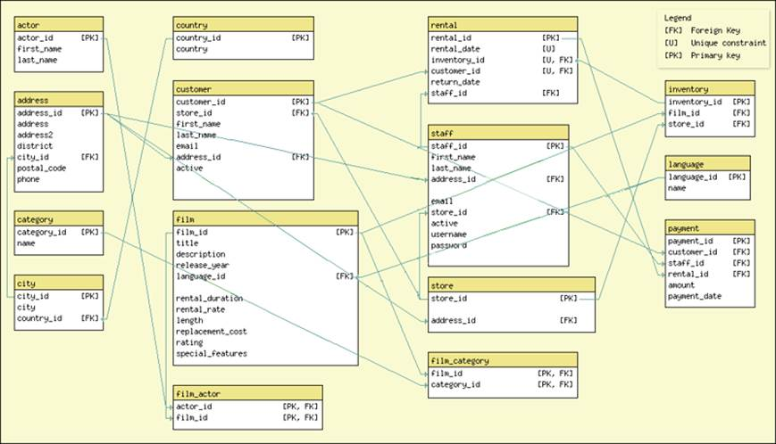

<!--
Copyright 2017 team1@course_bigdata, Saint Joseph's University

Licensed under the Apache License, Version 2.0 (the "License");
you may not use this file except in compliance with the License.
You may obtain a copy of the License at

   http://www.apache.org/licenses/LICENSE-2.0

Unless required by applicable law or agreed to in writing, software
distributed under the License is distributed on an "AS IS" BASIS,
WITHOUT WARRANTIES OR CONDITIONS OF ANY KIND, either express or implied.
See the License for the specific language governing permissions and
limitations under the License.
-->

# Project 4: Apache Pig Latin Exercise

*This project is developed by* ***Team 1***:
* Sarah Cooney
* Mingyuan Li
* Jason Qiao Meng

<div class="page-break"></div>

## Table of Content


## Introduction
*For team member contributions, see: [workload and responsibilities][ranking]*

### Entity Relations


### License
*Apache License V2.0* is applied to this project.

## Implementation

### Query A

### Query B

### Query C

### Query D

### Query E

### Query F

## Running the Map/Reduce Process
Use the following command to run the application:
```bash
$ hadoop jar HousingAnalysis.jar net.team1.dev.HousingAnalysis <input_dir_path> <output_dir_path>
```

# About Team 1
Team 1 consists of three members, who are:
+ Jason Qiao Meng *(Team Lead)*
+ Sarah Cooney *(Developer)*
+ Mingyuan Li *(Developer)*

<!-- Reference links -->
